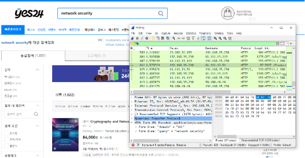
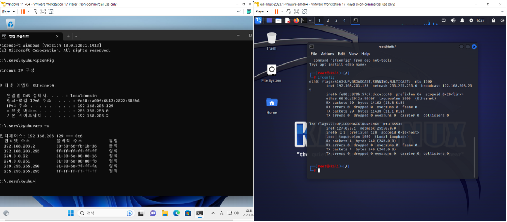
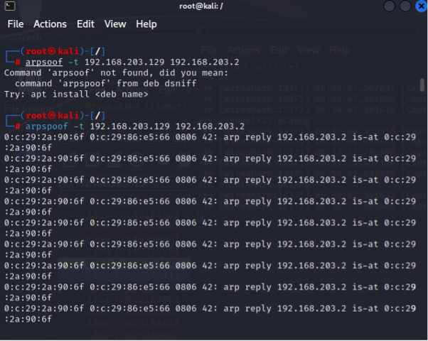
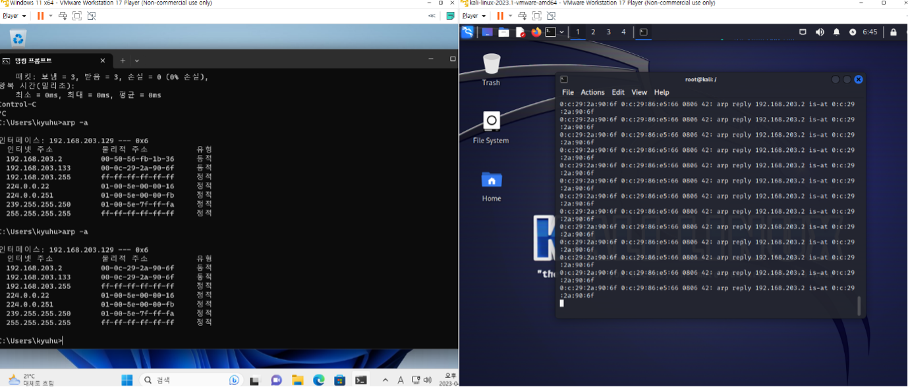
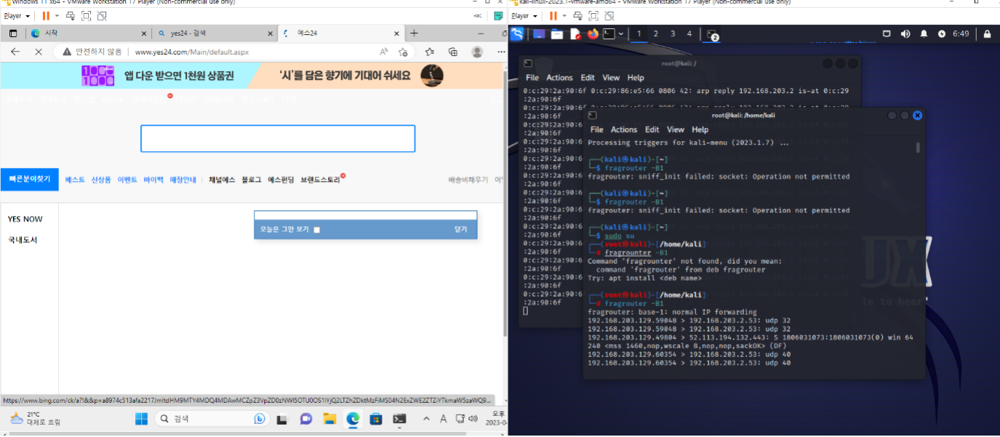
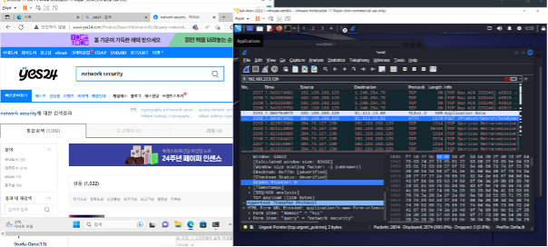
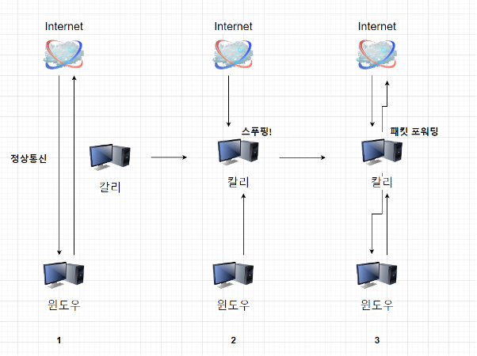

# Sniffing, Spoofing

## 이론 정리

### Port Scan

- 운영중 서버에 열려있는 TCP/UDP 포트를 찾는 행위
- **TCP 스캔** : TCP 스캔은 TCP 처음 연결 시 일어나는 3-웨이 핸드쉐이킹을 탐지하는 기법이다. 만약 핸드쉐이킹이 정상적으로 완료되었다면, 해당 TCP 포트는 정상적으로 열려 있는 것으로 판단할 수 있다.
- **SYN 스캔** : SYN 스캔은 TCP 핸드쉐이킹을 완전히 수행하지 않고, 처음 SYN 패킷만을 받은 후 검사를 완료하는 방식이다. 이 방식은 실제 TCP 연결이 일어나지 않기 때문에 'half-open 스캔"으로 부르기도 한다.
- **UDP 스캔** : UDP 프로토콜은 TCP와 다르게 핸드쉐이킹 과정이 존재하지 않는다. 그렇기에 보낸 패킷에 대한 응답이 없을 때 ICMP 패킷을 활용해 열린 포트를 찾는 방식으로 진행한다.

### Sniffing

- Sniffing이란 단어의 사전적 의미는 '코를 킁킁거리다', '냄새를 맡다' 등의 뜻.
- 사전적인 의미와 같이 해킹 기법으로서 스니핑은 네트워크 상에서 자신이 아닌 다른 상대방들의 패킷 교환을 엿듣는 것을 의미한다. 간단히 말하여 네트워크 트래픽을 도청(eavesdropping)하는 과정을 스니핑이라고 할 수 있다. 이런 스니핑을 할 수 있도록 하는 도구를 스니퍼(Sniffer)라고 한다.

### Spoofing

- Spoof란 단어의 사전적 의미는 '골탕 먹이다', '속여먹다'이다. 즉 해커가 악용하고자 하는 호스트의 IP 주소를 바꾸어서 이를 통해 해킹을 하는 것을 IP 스푸핑이라고 한다.
- 네트워크 시스템에서 서로 신뢰관계에 있는 A, B 두 시스템간에는 A 시스템의 어카운트를 가지고 B 시스템을 액세스 할 수 있다. 이는 네트워크에서 신뢰관계를 형성하는 서비스가 네트워크 주소에 기반하여 이를 인증하기 때문

### ARP Spoofing

- **ARP 스푸핑**(ARP spoofing)은 ARP메세지를 활용해 상대방의 패킷을 중간에 가로채는 공격기법
- 정상적인 통신 환경에서 희생자의 주소를 가지고 희생자가 받아야할 데이터를 공격자가 얻어가는 형식

---

## 실습

- **환경** : *VMWare*을 활용한 가상 네트워크 환경
- **도구** : *Wireshark*
- **Attacker** : *Kali Linux*
- **Victim** : *Window 11* `[IP: 192.168.203.129 , MAC: 00:50:56:fb:1b:36]`

  

> 와이어 샤크를 활용해 자신의 패킷을 스니핑 해보았다.
 

> Window 11에서 arp -a 명령어 실행		 	
> IP: `192.168.203.129` 				
> mac : `00:50:56:fb:1b:36`

 

> 공격자(칼리리눅스)에서 희생자(윈도우)에게 ARP Spoofing함
 

> 기존  MAC 주소 : `00:50:56:fb:1b:36`     

> 변경된  MAC 주소 : `00:0c:29:2a:90:6f`

 

> 희생자의 패킷을 정상적으로 보내주는 패킷 포워딩 실시 정상적으로 yes24 사이트에 접근할 수 있게 되었다.
 

> 희생자가 검색엔진을 통해 network security를 검색 한 것을 공격자의 Wireshark로 패킷 분석한 결과 “network security”의 검색을 위한 쿼리문이 담긴 패킷을 전송한 것을 확인 할  수 있었다.

 

> ARP Spoofing 실습 과정을 그림으로 정리

----

## 결론
- 칼리 리눅스에 기능들이 내장되어 있어서 훨씬 수월하게 진행 한거 같다.
- Victim 입장에선 이러한 Spoofing을 당하고 있다면 자신이 당하는지도 모를 것이라는걸 느꼈다
- 또한 단순히 패킷 분석 도구인줄 알았던 WireShark가 Attacker의 입장에서는 생각보다 강력한 도구라는걸 느꼈다.
- 추후 웹 서비스를 제공하는 프로젝트를 할때 이러한 공격 방식을 되새기며 클라이언트를 식별할 무언가가 필요하다는걸 느꼈다.

