# 무선 랜 보안

## 실습 목적

- Android, IOS 등의 앱개발에 필수적으로 사용되는 무선 네트워크(무선 LAN)
- 이러한 무선 네트워크는 무선 랜 이상의 편의성을 지니며 무선랜과 큰 차이 없는 성능을 보이며 실생활에 밀접하게 녹아들고 있다.
- 이러한 무선랜에 보안 취약성은 어떤게 있을까?
    - 최근 뉴스를 보면 무선 랜을 통해 가정집 cctv를 해킹해 집안 모습을 유출하는 사건
    - 무선 결제 기기를 해킹해 결제정보를 탈취 및 재사용
    - 다양한 범죄의 타겟으로 설정
- 이러한 범죄를 예방하고 기본적인 보안설정의 중요성을 알기 위해 기본적인 보안설정인 WEP와 WPA2-PSK의 기본 개념을 학습
- 무선 랜 통신의 취약점을 파악하여 모바일 환경에서의 보안을 강화하며 키 크랙 실습을 통해 무선 랜 해킹 공격의 동작 원리를 이해

---

## 실습 환경

- 실습한 공격 기술: WEP 키 크랙, WPA2-PSK 키 크랙
- 실습 환경: kali-linux, 무선랜카드(iptime n150au2), 무선랜 공유기(iptime N604), Window11, IOS

## wep 키 크랙

### WEP 키 크랙이란?

- WEP은 802.11b 프로토콜부터 적용된 기본적인 무선랜 암호화 기술이다.
- 암호화 알고리즘으로는 RC4를 사용하며, 암호화 키의 길이는 64비트와 128비트이다.
- WEP의 4-way Handshaking와 공용키를 이용하여 인증한다
- 그러나 WEP은 IV(초기 벡터)가 짧고, 인증방식이 취약하며 오래된 알고리즘을 사용하기 때문에 최근에는 WEP 사용이 줄어드는 추세이다.

### WEP 키 크랙 실습

### 일반적인 네트워크 인터페이스

- 무선랜 인식 전 iwconfig와 ifconfig
- 유선 네트워크 인터페이스인 eth0만 있으며 무선 인터페이스인 wlan0이 없는 것을 확인할 수 있다.
    
    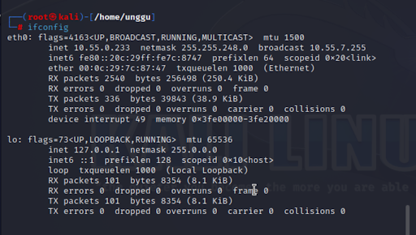
    
    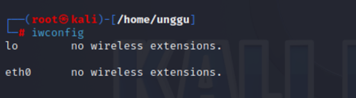
    

### 랜카드 삽입

- ifconfig와 iwconfig로무선 인터페이스 wlan0이 생성된 것을 통해 무선랜에 연결되었음을 확인
    
    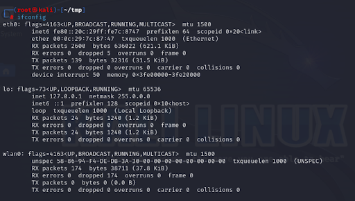
    
    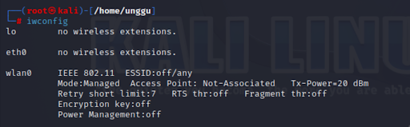
    

### 무선 랜 모니터 모드 설정

- 모니터 모드(Monitor Mode)란 IEEE 802.11(와이파이 규약) 패킷을 송수신 할 수 있는 모드
- `ifconfig wlan0 down`
- `airmon-ng start wlan0`
    
    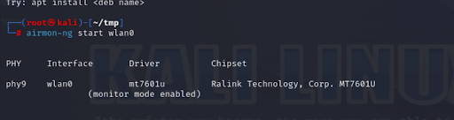
    
    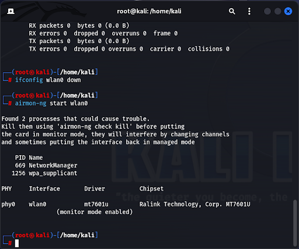
    
- `iwconfig`를 통해 mode가 *managed*에서 *monitor*로 변경된 것을 확인할 수 있다.

### 무선 랜 공유기에서 WEP 설정

- 암호 ***12345abcde*** 로 설정
- 암호화 방식은 **WEP**로 설정
    
    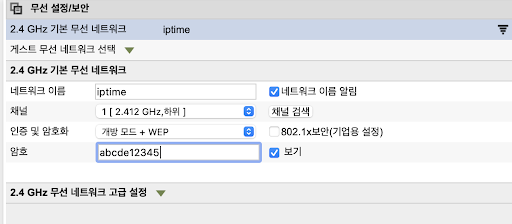
    

### 무선 랜 패킷 수집

- `airodump-ng wlan0`
    
    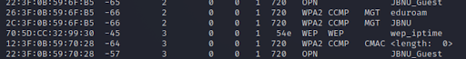
    
- 공격 대상 AP와 encryption이 WEP임을 확인한다.
    
    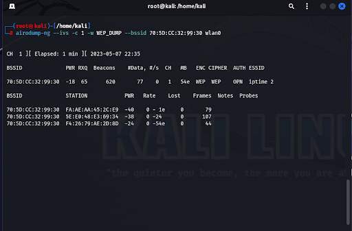
    
- `airodump-ng` 명령어를 이용해 무선랜 패킷을 수집한다.
    
    ```java
    airodump-ng –ivs -c 1 -w WEP_DUMP –bssid <MAC address> wlan0
    –ivs: 무선랜 패킷 스니핑 시 암호화 크랙에 필요한 IV만 수집한다.
    -c 1: 통신 채널 1만 스니핑한다.
    -w WEP_DUMP: WEP 키에 관한 내용을 WEP_DUMP.ivs 파일에 저장한다.
    –bssid <MAC address>: AP의 MAC 주소가 지정한 주소인 패킷만 저장한다.
    ```
    
- 디렉토리에 *WEP_DUMP.ivs* 파일이 생성된 모습이다.
    
    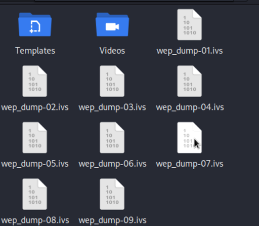
    

### 키 크랙

- 키 크랙을 시도한다.
    
    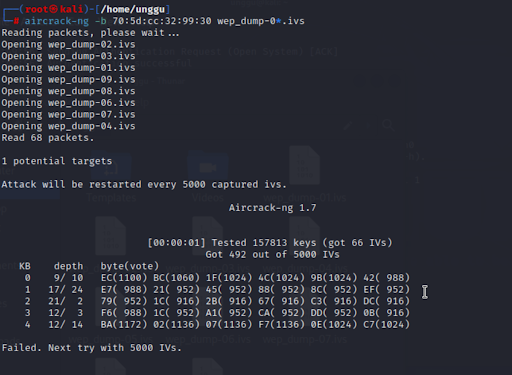
    
- 실패했다…

### 패킷 강제 생성

- 이전 과정에서 WEP 크랙에 실패한 원인을 클라이언트와 서버 간 데이터 통신이 충분하지 않았기 때문이라고 판단
    
    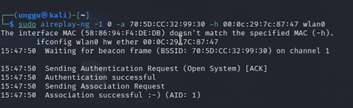
    
- `aireplay-ng` 명령어를 이용해 강제적으로 공격자와 AP 사이에 데이터를 발생
    
    ```java
    aireplay-ng -1 0 -a <AP’s MAC address> -h <Client’s MAC address> wlan0
    -1: aireplay를 이용해 거짓 인증을 수행한다.
    0: 패킷의 개수
    -a <MAC address>: AP의 MAC 주소를 지정한다.
    -h <Client’s MAC address>: 공격자의 MAC 주소를 지정한다.
    ```
    
    
    
- 여전히 키 크랙에 실패하였다…

---

## WPA2-PSK 키 크랙

### WPA2-PSK 키 크랙이란?

- WAP2-PSK는 WEP의 보안 취약점을 개선하기 위해서 802.11i 프로토콜부터 제공되는 암호화 기술
- WPA-1은 RC4 알고리즘의 IV 재사용 문제점을 개선한 TKIP 알고리즘을 함께 사용
- WPA2는 WPA의 문제점을 보완하기 위해 나온 기술로, CCMP 알고리즘을 사용
- CCMP는 AES 기반의 암호화 및 무결성 체크를 사용함으로써 안전한 암호화 방식을 제공
- WPA2는 WEP과는 다르게 단순한 패킷 수집으로는 크랙이 일어나지 않는것이 특징

### 무선랜 모니터 모드 설정

*이전과 동일하기에 사진 생략…*

### **무선랜 공유기 WPA2-PSK 보안 설정**

- 무선랜 공유기의 인증 방식을 WPA2-PSK으로 변경
- 암호는 ‘*freefree*’
- 통신 채널은 1
    
    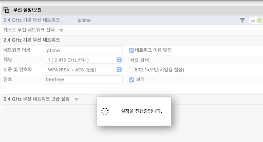
    

### 인증 패킷 수집

- airodump-ng 명령으로 공격 대상 AP와 encryption이 WPA2-PSK임을 확인한다.
- `airodump-ng wlan0`
    
    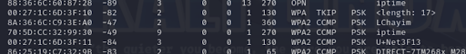
    
- airodump-ng 명령어를 사용하여 패킷을 수집한다
- `airodump-ng -c 1 –bssid <AP’s MAC address> -w WPA wlan0`
    
    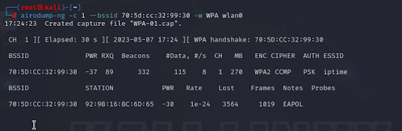
    
- 디렉토리에 WPA.cap 파일이 생성된 모습이다.
    
    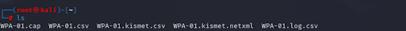
    
- 인증 패킷을 수집하기 위해 aireplay 명령어를 이용하여 AP에 접속된 클라이언트의 연결을 강제로 끊는다.
- `aireplay-ng -0 0 -a <MAC address> -c <Client’s MAC address> wlan0`
    
    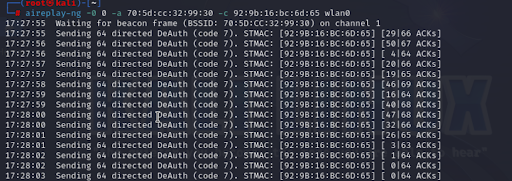
    
- 접속 연결전 아이폰의 연결 상태
    
    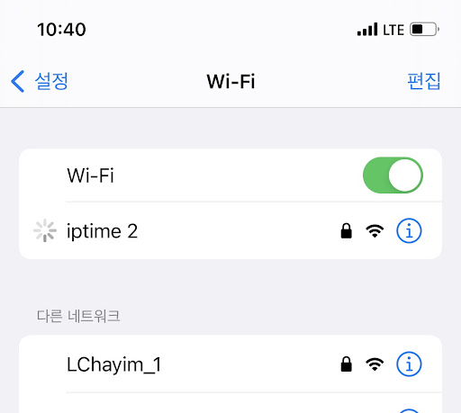
    
- `aireplay-ng -0 0 -a <MAC address> -c <Client’s MAC address> wlan0` 명령어 실행 후 접속을 강제로 끊은 후
    
    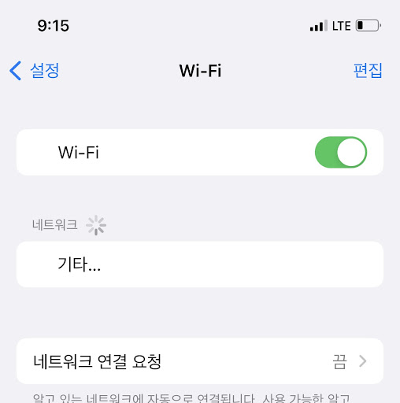
    
- 성공적으로 클라이언트와의 접속을 강제로 끊었다.

- 인증패킷이 확보된 것을 확인할 수 있다.
- `aircrack-ng WPA.cap`
    
    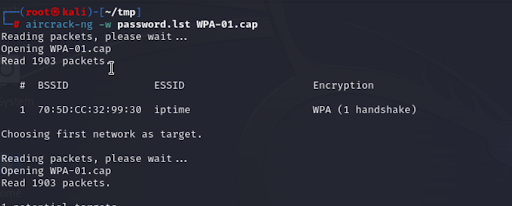
    

## **WPA2-PSK 키 크랙**

- WPA2-PSK 키 크랙은 WEP 키와 달리 무작위 크랙이 불가능
- 사전에 인증 문구가 포함된 ***password.lst*** 파일을 생성.
    
    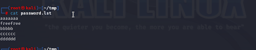
    
- 사전에 작성된 ***password.lst***를 활용해 키를 크랙
- `aircrack-ng -w password.lst WPA.cap`
    
    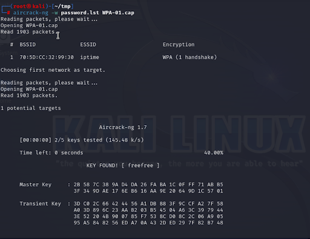
    
- **KEY FOUND!** 가 나온것을 볼 수 있다.

## 고찰

### 환경에 대한 문제

- 무선랜 패킷 모니터링을 위해 kali-linux에 내장된 aircrack-ng을 이용하려고 하였으나 kali-linux를 가상머신으로 사용하고 있어 외부 무선랜을 인식하지 못함.
- 이러한 문제 해결을 위한 시도
    - **kali-linux에 무선랜 드라이버 설치**
        - 공유기 칩셋에 따라 지원하는 드라이버가 다르고 현재까지 유효한 드라이버 파악이 어려웠다.
    - **가상머신의 kali-linux가 아닌 실제 환경에 aircrack-ng 설치**
        - 윈도우와 맥에서는 모니터링 모듈인 airmon-ng을 지원하지 않음
        - 무선 인터페이스를 모니터링 모드로 전환하고 이것을 전부 캡쳐한다는 점에서 스니핑과 유사하다고 생각
        - 다른 방법은 없을까?
            - **airport을 활용한 패킷 수집 *(실패)***
                - Mac OS에는 자체적으로 패킷을 모니터링 하고 수집하는 기능으로 Airport라는 기능이 존재
                - 이 기능을 활용해 패킷을 수집하여 xxx.cap이라는 파일을 만들었고 aircrack을 활용
                - 패킷 중에 암호화와 관련된 패킷이 없다는 결과만…
            - **tcpdump를 활용한 패킷 수집 *(실패)***
                - 리눅스 기반 OS에서 활용할 수 있는 tcpdump를 활용하여 패킷을 캡쳐
                - 하지만 aircrack-ng에서 IEEE802.11 패킷을 찾을 수가 없다는 결과
                - 아마도 tcpdump는 사전에 airmon-ng을 활용하여 모니터링 모드로의 변환이 필요하다고 추측
            - **wireshark의 프로미스커스 모드 활용 *(실패)***
                - 일반적으로 기기는 모든 패킷을 수용하지만 자신이 주소가 아닌 패킷은 버리고 자신이 목적지인 패킷만 수용
                - 프로미스커스 모드를 실행하여 모든 패킷을 수용하는 방식으로 AP와 Target의 통신을 스니핑 할 수 있다고 생각
                - 이를 활용해 Wireshark로 패킷을 수집해 pcapng파일을 pcap파일로 변경
                - aircrack을 실행하였지만 tcpdump와 마찬가지로 IEE802.11 패킷을 찾을 수 없다고 나왔다.
            - **결국 모니터링이 선행되어야 할 것 같다고 결론…**
- airmon-ng을 통한 모니터링 모드로의 전환 없이는 실습 진행이 불가능하다고 판단
- 데스크탑에 내장된 무선 랜 카드는 가상머신에서 인식할 수 없고 따로 USB 형태의 무선랜 카드를 구비가 필요하다고 생각…
- 결과적으로 현재 실습환경 상에서는 airmon-ng을 지원하는 가상머신 kali-linux에서 실습하는 방식이 최선이라고 생각
- 모니터 모드를 지원하는 USB형 무선 랜 카드를 쿠팡에서 구매했다…

### **WEP 키 크랙 실습에서의 크랙 실패 원인 분석**

- WEP 보안을 이용할 경우 AP 자체적으로 보안 문제 등의 이유로 외부의 통신을 제한하는 것으로 보임
- 실습 시 패킷 수집 속도가 매우 더뎠던 것으로 보아 AP와 클라이언트 간의 통신 패킷이 적어졌고, 이로 인해 크랙에 필요한 충분한 패킷을 수집할 수 없어 크랙에 실패한 것으로 추측
- 만약? 실제 통신처럼 패킷의 수를 늘린다면 성공 할 수 있지 않을까?
- 지인의 공유기(AP)를 빌려 다시한번 **WEP 키 크랙 실습**을 진행
    
    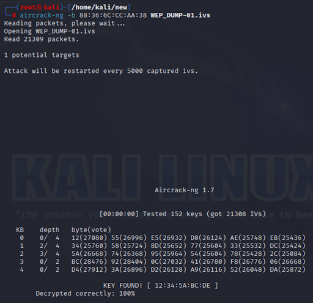
    
- 성공했다!!!
- 이전 실습과는 다르게 패킷 수집 속도가 눈에 띄게 빨라진 것을 확인할 수 있었고, 크랙에 필요한 패킷이 충분히 모인 것으로 생각
- 실패의 원인에 대한 추측이 맞았다고 생각한다…

### 무선 랜 해킹 대응 방안

- **WEP 암호화 사용 금지**
    - WEP은 40비트 또는 104비트의 고정키를 사용하기에 무차별 대입 공격에 매우 취약하다.
    - 이번 실습과는 다른 방법이지만 RC4 알고리즘을 공격자가 패킷을 가로채어 크랙하는 것 또한 허용
    - 이는 알고리즘 자체의 문제로써 암호화 키와 같은 변수가 초기 값에게만 의존하기에 먀우 약한 암호화 방식
    - 사용을 지양하고 최신의 암호화 방식을 유지한다.
- **WPA의 긴 암호화 키 사용**
    - WEP의 보안 취약점을 개선한 WPA는 강력한 보안기능을 제공
    - 그러나 WPA를 사용할 경우 너무 작은 암호화 키를 사용하는 것은 본 실습에서 보듯이 쉽게 크랙될 가능성이 존재
    - 긴 암호화 키를 사용해 무차별 대입 공격에 대해 면역
    - MAC주소를 필터링을 하여 허가된 특정 장치만 네트워크에 연결하게 설정

### 느낀점

- 무선 랜은 전파를 이용하여 통신을 수행하기 때문에, 실제 랜선이 필요한 유선 랜과는 달리 누구나 접속이 가능
- 암호화라는 대책이 있지만 암호화 방식에 따른 취약점과 무차별 대입 공격에서 자유롭기 쉽지 않음
- 특히나 모두가 사용하는 학교나 카페 같은 공개에서 누군가가 Wireshark 또는 ettercap을 활용해 스니핑을 시도한다면 개인정보 유출등의 피해의 가능성이 있다고 생각함
    - 학교의 JBNU Wifi를 WireShar로 캡쳐한 사진
        
        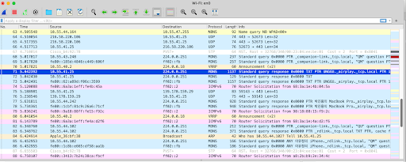
        
- 즉, 공개 Wifi를 사용할 때에는 스니핑의 대한 위험성을 인식하고 민감한 정보의 입력은 자제할 필요성을 느낌

### 참고 자료

- *네트워크 해킹과 보안 4판(양대일, 홍성혁)*
- *정보보안개론 초판(이상진)*
- *Wireless Hacking - 티스토리 (https://qzqz.tistory.com/383)*
